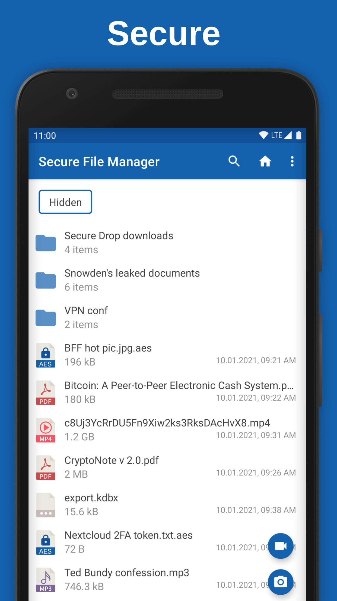
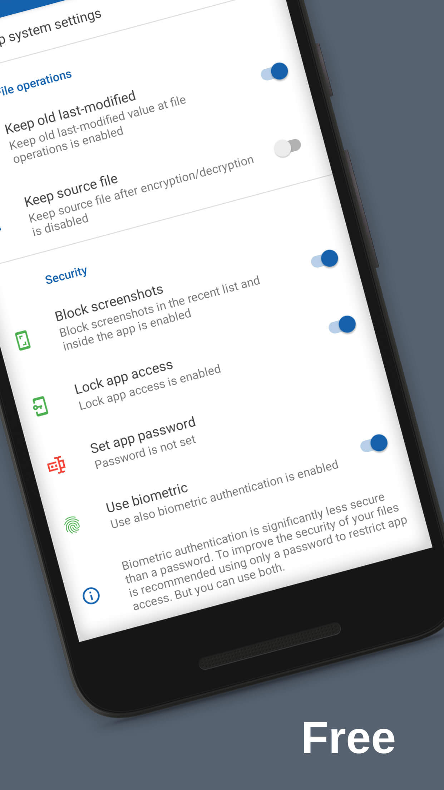
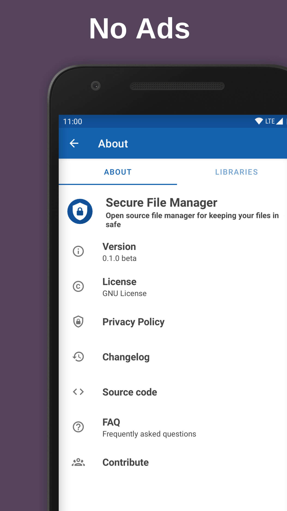
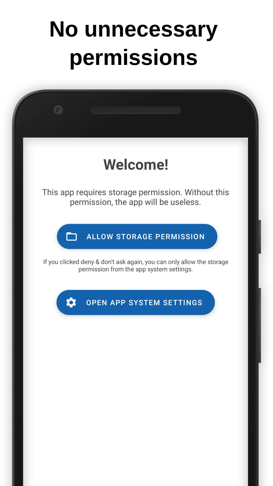
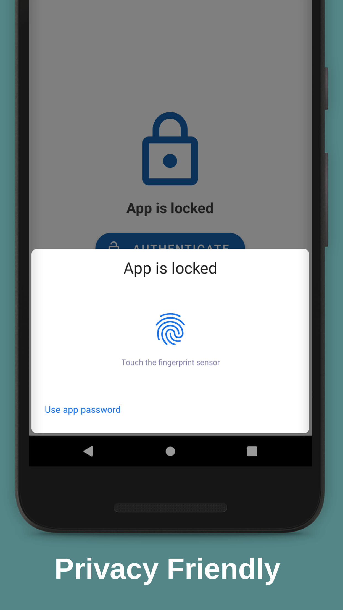
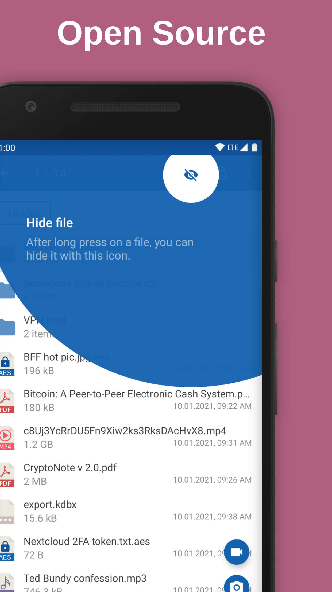

# Secure File Manager

<p align="center">
  <strong>Open-source Android file manager for hiding, encrypting, and locking down your files.</strong>
</p>

<p align="center">
  <a href="LICENSE"></a>
  <a href="https://github.com/LTechnologies0/Secure-File-Manager/actions/workflows/ci.yml"></a>
  <a href="https://github.com/LTechnologies0/Secure-File-Manager/releases"></a>
  <a href="https://ltechnologies0.github.io/Secure-File-Manager/"></a>
  <a href="https://crowdin.com/project/secure-file-manager"></a>
  
  
</p>


**Secure File Manager** is an open-source Android file manager focused on keeping your files safe: hide files from the gallery/media scanner, encrypt files and folders, lock the app with a password or biometrics, and manage everything with a modern Material 3 interface. Based on [Simple File Manager](https://github.com/SimpleMobileTools/Simple-File-Manager) and part of the [OnionPhone](https://onionphone.org) app family — this fork rebrands the app (`ltechnologies.onionphone.securefilemanager`) and is gradually converting the codebase to Kotlin.

### :bangbang: This app is useless if you have [a rooted device](https://github.com/Secure-File-Manager/Secure-File-Manager/wiki/Frequently-Asked-Questions#i-have-a-rooted-device-are-there-some-security-implications)!

#### This is a beta version of the app. Do not use it with important files yet — the developers are not responsible for data loss or corruption.

:heavy_check_mark: Open source · :heavy_check_mark: [Privacy friendly](./PRIVACY_POLICY.md) · :heavy_check_mark: Free · :heavy_check_mark: No ads · :heavy_check_mark: No unnecessary permissions

---

## Table of contents

- [Features](#features)
- [Architecture](#architecture)
- [Install from GitHub Releases](#install-from-github-releases)
- [Build it yourself](#build-it-yourself)
- [API documentation (KDoc)](#api-documentation-kdoc)
- [Screenshots](#screenshots)
- [Security](#security)
- [Contributing](#contributing)
- [License](#license)

---

## Features

| Feature | Description |
|---------|-------------|
| **Hide files** | Hide files/folders from the gallery and other apps without moving them off-device |
| **Encrypt files** | Encrypt individual files, or create/extract password-protected encrypted Zip archives |
| **App lock** | Password or biometric authentication to open the app *(optional)* |
| **Checksums** | Compute MD5, SHA1, SHA256, SHA512 for any file |
| **Privacy hardening** | Disable screenshots, disable thumbnails, clear cached thumbnails *(all optional)* |
| **Media destinations** | Choose where new photos/videos are saved |
| **Remote storage** | Connect to SFTP servers |
| **Localization** | English, French, Spanish (community), Japanese, Russian, Danish (partial) |

---

## Architecture

Single-module Gradle project — see [docs/ARCHITECTURE.md](docs/ARCHITECTURE.md) for the full package layout and feature map.

```
:app
 └── ltechnologies.onionphone.securefilemanager
      ├── activities / fragments / dialogs / views   (UI)
      ├── adapters                                    (RecyclerView)
      ├── storage / transfer / providers              (file I/O, SFTP, encryption)
      ├── helpers                                      (config, logging, hashing)
      └── models / interfaces / observers / receivers / services
```

| Layer | Technologies |
|-------|--------------|
| UI | Android Views + ViewBinding, Material Components |
| Async | Kotlin Coroutines |
| Encryption | [Argon2Kt](https://github.com/lambdapioneer/argon2kt) (key derivation), [Zip4j](https://github.com/srikanth-lingala/zip4j) (encrypted archives) |
| Remote storage | [sshj](https://github.com/hierynomus/sshj) (SFTP) |
| Thumbnails | [Glide](https://github.com/bumptech/glide) |
| Dependency auditing | OWASP `dependency-check` Gradle plugin |
| Licenses UI | [AboutLibraries](https://github.com/mikepenz/AboutLibraries) |

---

## Install from GitHub Releases

1. Open **[Releases](https://github.com/LTechnologies0/Secure-File-Manager/releases)**.
2. Download the APK matching your device CPU:

   | APK suffix | Devices |
   |------------|---------|
   | `arm64-v8a` | Most modern phones (2017+) |
   | `armeabi-v7a` | Older 32-bit ARM phones |
   | `x86_64` | Emulators, some tablets |
   | `x86` | Older emulators |

3. Enable **Install unknown apps** for your browser/files app.
4. Install the APK.

> Release APKs are signed with the project release key when CI secrets are configured. Verify the signature with `apksigner verify`.

Also available on [F-Droid](https://f-droid.org/packages/ltechnologies.onionphone.securefilemanager) for the upstream app id.

---

## Build it yourself

### Prerequisites

| Tool | Version |
|------|---------|
| JDK | **17** (Temurin recommended) |
| Android SDK | API **37**, Build-Tools **36+** |
| Gradle | **9.x** (wrapper included) |

Set `ANDROID_HOME` / `ANDROID_SDK_ROOT` and create `local.properties`:

```properties
sdk.dir=/path/to/Android/Sdk
```

Optional: copy `secrets.properties.example` to `secrets.properties` if you need BrowserStack device-farm testing (`./gradlew connectedDebugAndroidTest` on BrowserStack — not required for a normal build).

### One-shot commands by OS

<details>
<summary><strong>Linux / macOS</strong></summary>

```bash
# Clone
git clone https://github.com/LTechnologies0/Secure-File-Manager.git && cd Secure-File-Manager

# Debug APK (arm64-v8a, fastest)
./gradlew :app:assembleDebug

# All unit tests
./gradlew test

# Release APKs — all 4 ABIs (unsigned without keystore)
./gradlew :app:assembleRelease

# Release APKs — signed locally
cp keystore.properties.example keystore.properties
# Edit keystore.properties, then:
./gradlew :app:assembleRelease

# Install debug on connected device
./gradlew :app:installDebug

# API documentation
./gradlew dokkaGenerate
# → build/dokka/html/index.html
```

</details>

<details>
<summary><strong>Windows (PowerShell)</strong></summary>

```powershell
git clone https://github.com/LTechnologies0/Secure-File-Manager.git; cd Secure-File-Manager

# Debug APK
.\gradlew.bat :app:assembleDebug

# Tests
.\gradlew.bat test

# Release (all ABIs)
.\gradlew.bat :app:assembleRelease

# Install debug
.\gradlew.bat :app:installDebug

# Docs
.\gradlew.bat dokkaGenerate
```

There are also ready-made PowerShell helper scripts: `scripts/setup-and-install.ps1` and `scripts/install-to-device.ps1`.

</details>

### Output paths

| Task | Output |
|------|--------|
| `assembleDebug` | `app/build/outputs/apk/debug/app-<abi>-debug.apk` |
| `assembleRelease` | `app/build/outputs/apk/release/app-<abi>-release.apk` |
| `dokkaGenerate` | `build/dokka/html/index.html` |
| `test` | `**/build/reports/tests/` |

### Local release signing

```bash
bash scripts/generate-release-keystore.sh
cp keystore.properties.example keystore.properties
# Edit paths/passwords — never commit these files
./gradlew :app:assembleRelease
```

---

## API documentation (KDoc)

Public APIs are documented with **KDoc** in source. HTML reference is generated with **[Dokka](https://kotlinlang.org/docs/dokka-introduction.html)**:

```bash
./gradlew dokkaGenerate
# → build/dokka/html/index.html
```

**Live docs** (auto-deployed on push to `main`): [ltechnologies0.github.io/Secure-File-Manager](https://ltechnologies0.github.io/Secure-File-Manager/)

---

## Screenshots

<div style="display:flex;">






</div>

---

## Security

- **No secrets in repo**: `keystore.properties`, `secrets.properties`, and `local.properties` are gitignored — see [SECURITY.md](SECURITY.md).
- **CI signing**: GitHub Actions secrets only.

| GitHub secret | Purpose |
|---------------|---------|
| `RELEASE_KEYSTORE_BASE64` | Base64-encoded keystore |
| `RELEASE_KEYSTORE_PASSWORD` | Keystore password |
| `RELEASE_KEY_ALIAS` | Key alias |
| `RELEASE_KEY_PASSWORD` | Key password |

Enable in repo settings: Dependabot alerts, secret scanning, push protection, CodeQL.

---

## Contributing

See [CONTRIBUTING.md](./CONTRIBUTING.md). In short:

1. Fork and create a feature branch from `main`.
2. Run `./gradlew test :app:assembleDebug` before pushing.
3. Add KDoc for new public APIs.
4. Open a PR — CI runs tests, debug build, CodeQL, and dependency review.

Translations happen on [Crowdin](https://crowdin.com/project/secure-file-manager). See [FAQ](https://github.com/Secure-File-Manager/Secure-File-Manager/wiki/Frequently-Asked-Questions) and [CHANGELOG.md](CHANGELOG.md) for release history.

## Acknowledgments :heart:

This app is based on the [Simple File Manager](https://github.com/SimpleMobileTools/Simple-File-Manager), continued via [Secure-File-Manager/Secure-File-Manager](https://github.com/Secure-File-Manager/Secure-File-Manager).

Open-source components used: [AboutLibraries](https://github.com/mikepenz/AboutLibraries) · [AppIntro](https://github.com/AppIntro/AppIntro) · [Argon2Kt](https://github.com/lambdapioneer/argon2kt) · [TapTargetView](https://github.com/KeepSafe/TapTargetView) · [Zip4j](https://github.com/srikanth-lingala/zip4j) · [Glide](https://github.com/bumptech/glide) · [sshj](https://github.com/hierynomus/sshj)

---

## License

Licensed under the [GPLv3](./LICENSE).

F-Droid logo is a trademark of F-Droid Limited. GitHub logo is a trademark of GitHub Inc.
